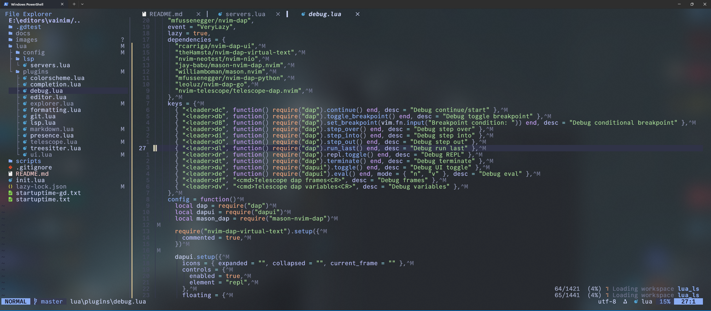
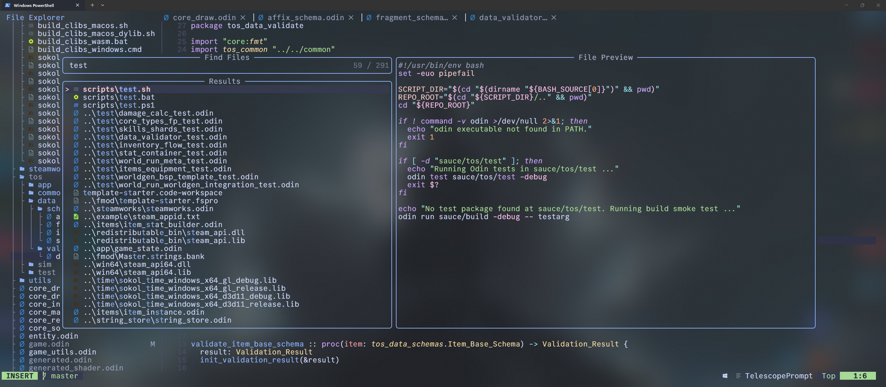
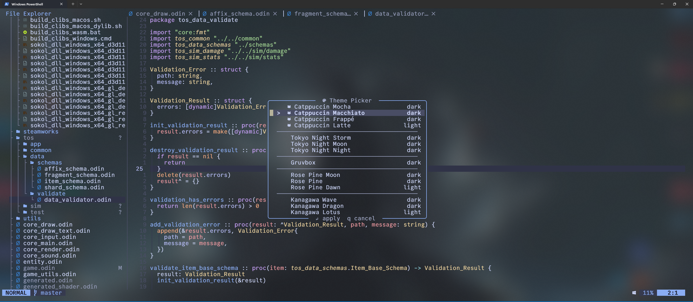

# vainim - personal nvim config

<!--toc:start-->
- [vainim - personal nvim config](#vainim-personal-nvim-config)
  - [Setup](#setup)
  - [Showcase](#showcase)
  - [Structure](#structure)
  - [Plugins](#plugins)
  - [Language servers](#language-servers)
  - [Key bindings](#key-bindings)
<!--toc:end-->

I am not maintaining this config for anybody but myself, so as long as it still works for me it is unlikely that I will address an issue someone might create.

Requires Neovim 0.11+. Space is leader. On first launch, lazy.nvim bootstraps itself and installs everything.

## Setup

### Windows (native)

```powershell
powershell -ExecutionPolicy Bypass -File scripts/setup.ps1
```

This creates `%LOCALAPPDATA%\nvim` as a junction to this repo.

### Linux / WSL

```bash
bash scripts/setup.sh
```

This creates `${XDG_CONFIG_HOME:-~/.config}/nvim` as a symlink to this repo.

### Running both Windows and WSL

If you are moving to a WSL-first flow, prefer keeping your main checkout inside WSL (for faster file I/O):

```bash
~/src/vainim
```

Then run `bash scripts/setup.sh` in WSL, and keep a separate Windows checkout for native Windows Neovim (`scripts/setup.ps1`).

If you want a single shared checkout, you can keep it on a Windows drive (for example `E:\editors\vainim`) and point WSL to `/mnt/e/editors/vainim`, but Neovim/plugin startup is usually slower from `/mnt/*`.

Note: plugin/tool installs are per environment (Windows and WSL maintain separate Neovim data directories).

## Showcase





## Structure

```
lua/
  config/
    options.lua       vim options
    keymaps.lua       core keybindings
    autocmds.lua      autocommands (yank highlight, cursor restore, transparent bg, etc.)
    theme.lua         theme persistence helpers
    theme_picker.lua  floating theme picker with live preview
  plugins/
    colorscheme.lua   catppuccin, tokyonight, gruvbox, rose-pine, kanagawa
    ui.lua            lualine, bufferline, noice, nvim-notify, alpha dashboard, indent-blankline
    explorer.lua      nvim-tree
    telescope.lua     telescope + fzf-native + file-browser
    treesitter.lua    treesitter + textobjects
    completion.lua    blink.cmp + LuaSnip + friendly-snippets
    lsp.lua           mason + mason-lspconfig + nvim-lspconfig
    formatting.lua    conform.nvim (format) + nvim-lint (lint) + mason-tool-installer
    git.lua           gitsigns + vim-fugitive + toggleterm (lazygit)
    markdown.lua      markview markdown renderer
    presence.lua      discord rich presence
    debug.lua         nvim-dap, dap-ui, neotest
    editor.lua        which-key, Comment, autopairs, nvim-surround, flash, trouble,
                      colorizer, inc-rename
  lsp/
    servers.lua       edit this to add/remove language servers
scripts/
  setup.ps1           creates the Windows junction to %LOCALAPPDATA%\nvim
  setup.sh            creates the Linux/WSL symlink to ~/.config/nvim
```

## Plugins

| Category       | Plugin(s) |
|----------------|-----------|
| Plugin manager | lazy.nvim |
| Colorschemes   | catppuccin, tokyonight, gruvbox.nvim, rose-pine, kanagawa |
| Statusline     | lualine |
| Bufferline     | bufferline.nvim |
| Notifications  | nvim-notify + noice.nvim |
| Dashboard      | alpha-nvim |
| Explorer       | nvim-tree |
| Fuzzy finding  | telescope.nvim + fzf-native + file-browser |
| Syntax         | nvim-treesitter + treesitter-textobjects |
| Completion     | blink.cmp + LuaSnip + friendly-snippets |
| LSP            | nvim-lspconfig + mason.nvim + mason-lspconfig |
| Formatting     | conform.nvim + nvim-lint + mason-tool-installer |
| Debugging      | nvim-dap + nvim-dap-ui + nvim-dap-virtual-text + mason-nvim-dap |
| Testing        | neotest + neotest-python + neotest-go + neotest-vitest + neotest-plenary |
| Git            | gitsigns.nvim + vim-fugitive + toggleterm (lazygit) |
| Markdown       | markview.nvim |
| Presence       | presence.nvim |
| Navigation     | flash.nvim |
| Editing        | Comment.nvim, nvim-autopairs, nvim-surround, inc-rename |
| UI helpers     | which-key, nvim-colorizer, todo-comments, trouble.nvim |
| Indent guides  | indent-blankline |

## Language servers

Edit `lua/lsp/servers.lua` to add or remove servers — Mason installs them automatically on next launch.

Defaults: lua, python (basedpyright), typescript, html, css, json, yaml, bash, c/c++, rust, odin, markdown.

GDScript is handled separately (not via Mason) — connects to Godot's built-in LSP on port 6005. Godot must be open when editing `.gd` files.

## Key bindings

```
<leader>ff   find files           <leader>e    explorer toggle
<leader>fg   live grep            <leader>tg   lazygit
<leader>bv   split buffer vertical <leader>bs  split buffer horizontal
<leader>um   markdown preview      <leader>uM  markdown split preview
<leader>ga   git add file          <leader>gA  git add all
<leader>gu   git unstage file      <leader>gm  git commit
<leader>gP   git push              <leader>gL  git pull --rebase
<leader>dc   debug continue/start  <leader>db  debug breakpoint
<leader>do   debug step over       <leader>di  debug step into
<leader>du   debug ui toggle       <leader>Td  debug nearest test
<leader>Tr   run nearest test      <leader>Tf  run test file
<leader>Ts   toggle test summary   <leader>TO  test output panel
<leader>ut   theme picker         <leader>tt   floating terminal
<leader>ub   toggle transparency  <leader>un   cycle line numbers
<leader>lm   Mason                <leader>ca   code action
<leader>rn   rename symbol        <leader>x    trouble diagnostics
```

Press Space and wait for which-key to see everything else.
